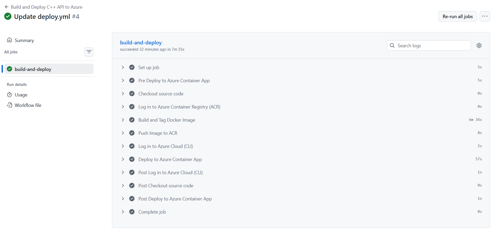
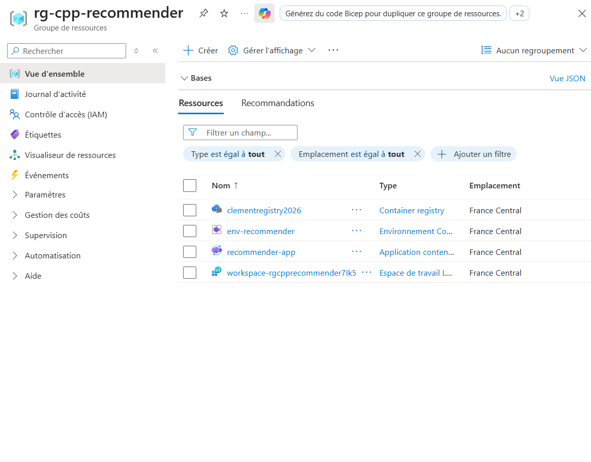
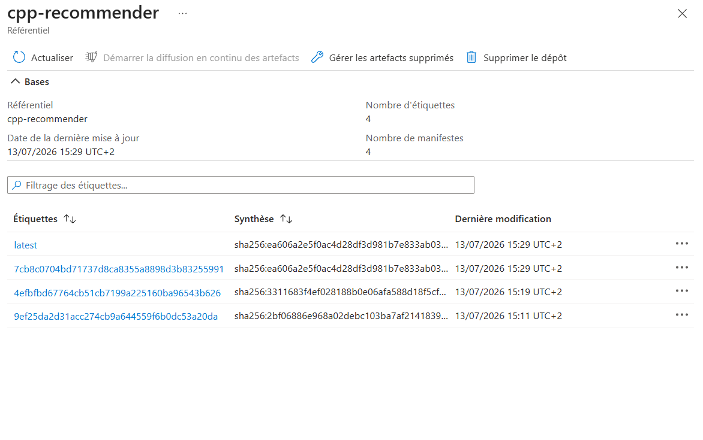
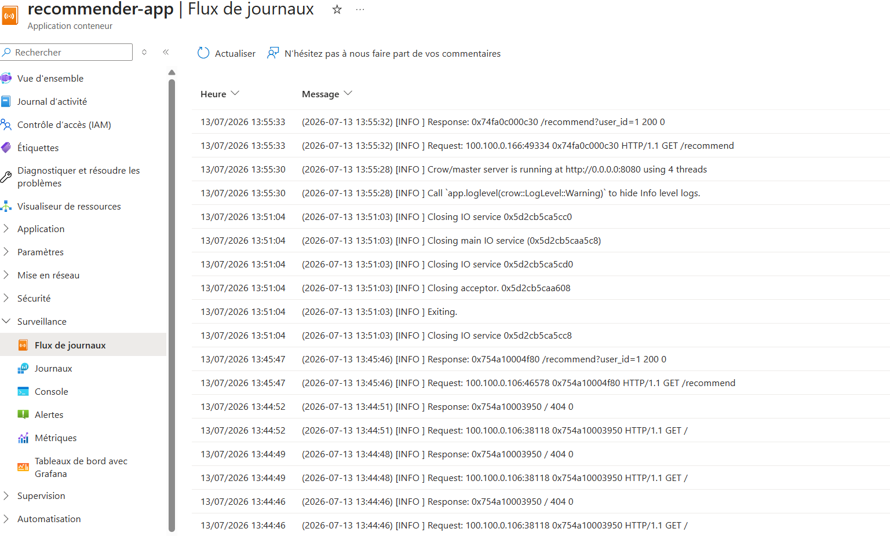
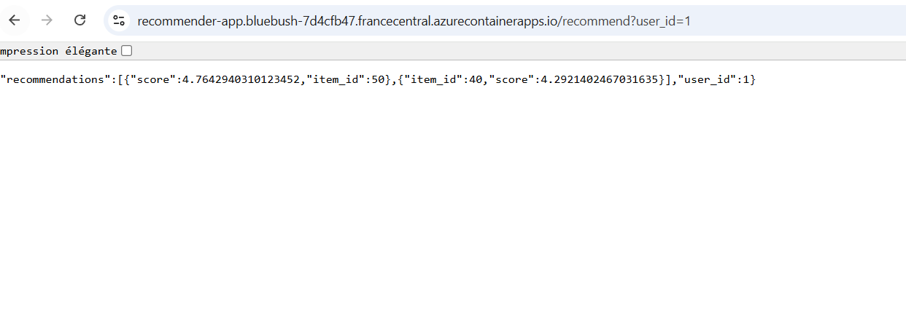

# Système de recommandation (C++ / Azure Container Apps)

Ce projet implémente un système de recommandation basé sur le filtrage collaboratif utilisateur (User-Based Collaborative Filtering) en C++. L'algorithme utilise la similarité cosinus pour évaluer la proximité entre les profils afin de prédire les scores d'intérêt et générer des recommandations ciblées.

Initialement conçu comme un outil en ligne de commande, le projet a été transformé en microservice Cloud-Native : le moteur C++ est encapsulé dans une API REST asynchrone, conteneurisé avec Docker et déployé sur Microsoft Azure.

---

## Architecture & Stack Technique

* **Langage utilisé :** C++20. Utilisation de structures `std::unordered_map` et `std::unordered_set` pour maintenir une complexité en $O(1)$ sur les étapes clés de recherche et de mapping.
* **Interface API :** Crow Framework (API HTTP asynchrone et multithreadée en C++).
* **Conteneurisation :** Docker (Multi-stage build pour isoler la phase de compilation et obtenir une image finale de production légère (moins de 50 Mo)).
* **Hébergement Cloud :** Azure Container Apps (mode Serverless avec autoscaling basé sur le trafic HTTP) et Azure Container Registry (ACR) pour le stockage privé de l'image.
* **Pipeline CI/CD :** GitHub Actions pour l'automatisation complète (le push de code déclenche le build Docker et la mise à jour automatique sur Azure).

---

## Logique Algorithmique

Le système charge les données en mémoire et indexe les utilisateurs. Les étapes clés du calcul sont les suivantes :
1. **Profils utilisateurs :** Calcul de la norme euclidienne du vecteur de notation de chaque utilisateur (requis pour la similarité).
2. **Similarité Cosinus :** Évaluation de la corrélation entre l'utilisateur cible ($u$) et les autres profils ($v$):
   $$sim(u,v)=\frac{\sum r_{u,i}\cdot r_{v,i}}{|u|\cdot|v|}$$
3. **Prédiction et filtrage :** Moyenne pondérée des scores sur les items non encore évalués par l'utilisateur cible, tri, puis extraction du Top-N.

---
## Automatisation CI/CD (GitHub Actions)

À chaque `push` sur la branche `main`, un workflow automatisé prend le relais pour compiler le code C++, générer le livrable Docker et mettre à jour l'infrastructure Azure sans interruption de service.

> **Capture 1 : Pipeline CI/CD au vert**
> 

---

## Déploiement Cloud (Microsoft Azure)

L'application est déployée au sein d'un groupe de ressources dédié localisé dans la région `francecentral`. 

### 1. Vue d'ensemble des ressources provisionnées
L'architecture s'appuie sur un environnement managé Container Apps couplé à un registre de conteneurs privé (ACR).

> **Capture 2 : Groupe de ressources sur le Portail Azure**
> 

### 2. Registre d'artefacts (Azure Container Registry)
L'image finale de production est versionnée et stockée de manière sécurisée.

> **Capture 3 : Répertoire d'images dans l'ACR**
> 

### 3. Cycle de vie & Métriques de l'API
Le service est configuré avec un mécanisme d'autoscaling dynamique pour valider le bon fonctionnement de l'application.

> **Capture 4 : Journaux de la console (Log Stream)**
> 

> **Capture 5 : API en production dans le navigateur **
> url (en arrêt pour économiser les ressources): https://recommender-app.bluebush-7d4cfb47.francecentral.azurecontainerapps.io/recommend?user_id=1
> L'API retourne avec succès les recommandations pour l'utilisateur `user_id=1`(avec comme dataset "data.txt"). Il est également possible d'ajouter le paramètre optionnel `&topN=X` pour limiter le nombre maximal de résultats retournés
> 

---
## Stratégie de Déploiement et d'Économie des Ressources

Pour optimiser l'utilisation du crédit de test Azure et éviter le gaspillage de ressources laissées actives inutilement, le cycle de vie de l'infrastructure est géré de façon dynamique :
* L'infrastructure sous-jacente est provisionnée et détruite via des scripts Azure CLI.
* Le pipeline GitHub Actions permet une reconstruction automatique et une mise en production de l'application à l'identique rapidement.
* Les preuves de fonctionnement en conditions réelles (portail Azure, exécution du pipeline et réponses de l'API) sont documentées via les captures d'écran ci-dessus.

---

## Exécution Locale (Docker)

Le conteneur est configuré pour charger automatiquement les jeux de données d'exemple situés dans le répertoire `dataset/`.

```bash
docker build -t cpp-recommender-api .
docker run -p 8080:8080 cpp-recommender-api
